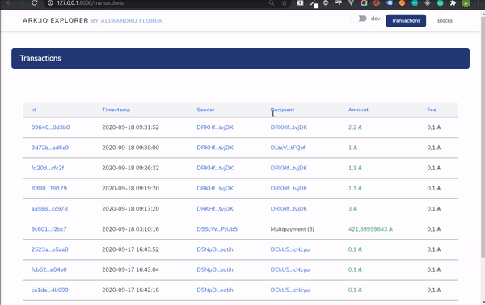

🎉 Alexandru's Explorer




### Arhitecture
All items related to the information from the Ark Api are under the ```ark``` folder.

For a quick starting point I have used ```Laravel 8``` & ```Jetstream``` with the ```Livewire``` templates.

### Ui
First time playing with Livewire, Alpine.js and Tailwind css :)
There are pages for browsing ```Transactions```,```Blocks```, their respective details page and a ```Wallet``` detail page.

I have used information from the Ark Vue js explorer repo, eg the transactions types, currency format and multipayment format, in order to math the display.

The network can be toggled from the top navigation.

I did not get around to implement user preferences or a more mobile Ui.

### Setup
A basic Docker setup is availabe, that spawns 2 containers, one for PHP and one for MySql.

Please check the ```.env``` file and configure values accordingly, if changes are made, or using the **local** setup;

#### Docker
Run
```
docker-compose build --no-cache
```
this will take some time, so treat yourself to some pop-corn:) and then
```
docker-compose up
```

In Docker I am not sure how to properly run Dusk tests.

The go to the container Ip to see the app.

#### Local - needs Composer & PHP 7.4 installed
Install dependencies
```
composer install
composer dump-autoload
```

Run migrations
```
php artisan migrate
```

Run the following command to start the Backend
```
php artisan serve
```

Run tests
```
php artisan test
php artisan dusk
```
